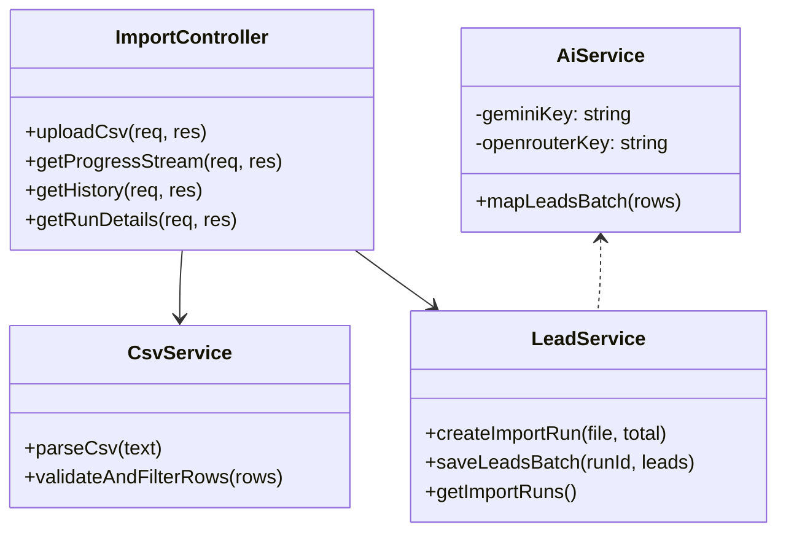

# Class Diagrams

Object classes design layout.

```mermaid
classDiagram
    class ImportController {
        +uploadCsv(req, res)
        +getProgressStream(req, res)
        +getHistory(req, res)
        +getRunDetails(req, res)
    }

    class CsvService {
        +parseCsv(text)
        +validateAndFilterRows(rows)
    }

    class AiService {
        -geminiKey: string
        -openrouterKey: string
        +mapLeadsBatch(rows)
    }

    class LeadService {
        +createImportRun(file, total)
        +saveLeadsBatch(runId, leads)
        +getImportRuns()
    }

    ImportController --> CsvService
    ImportController --> LeadService
    AiService <.. LeadService
```
