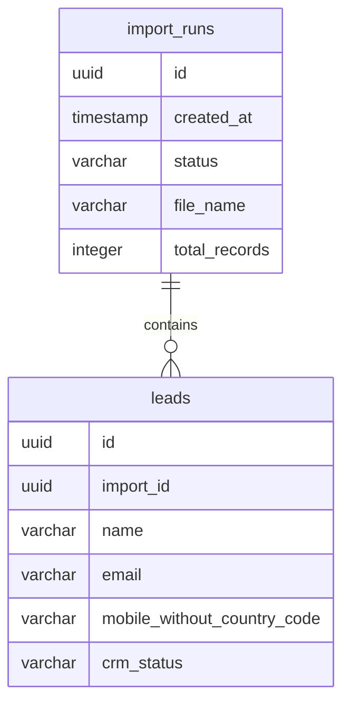

# Entity Relationships

Database schema structure ERD.

```mermaid
erDiagram
    import_runs ||--o{ leads : contains
    
    import_runs {
        uuid id
        timestamp created_at
        varchar status
        varchar file_name
        integer total_records
    }

    leads {
        uuid id
        uuid import_id
        varchar name
        varchar email
        varchar mobile_without_country_code
        varchar crm_status
    }
```
