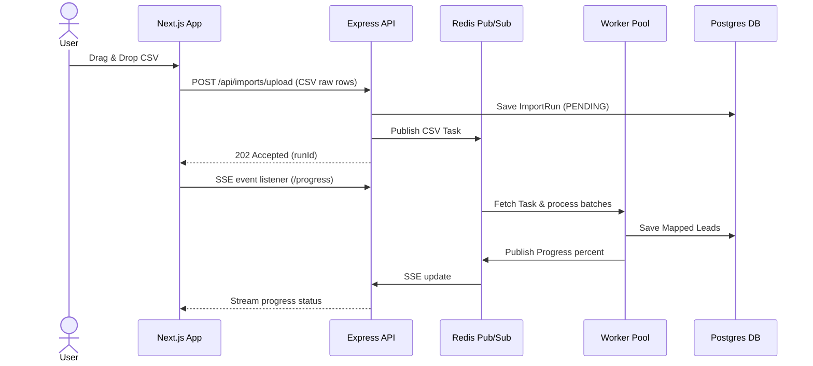

# UML Diagrams

Sequence process flow chart for lead uploads.

```mermaid
sequenceDiagram
    actor User
    participant FE as Next.js App
    participant BE as Express API
    participant R as Redis Pub/Sub
    participant W as Worker Pool
    participant DB as Postgres DB

    User->>FE: Drag & Drop CSV
    FE->>BE: POST /api/imports/upload (CSV raw rows)
    BE->>DB: Save ImportRun (PENDING)
    BE->>R: Publish CSV Task
    BE-->>FE: 202 Accepted (runId)
    FE->>BE: SSE event listener (/progress)
    R->>W: Fetch Task & process batches
    W->>DB: Save Mapped Leads
    W->>R: Publish Progress percent
    R->>BE: SSE update
    BE-->>FE: Stream progress status
```
